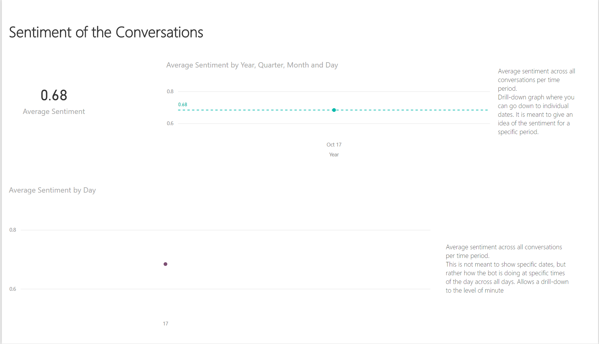
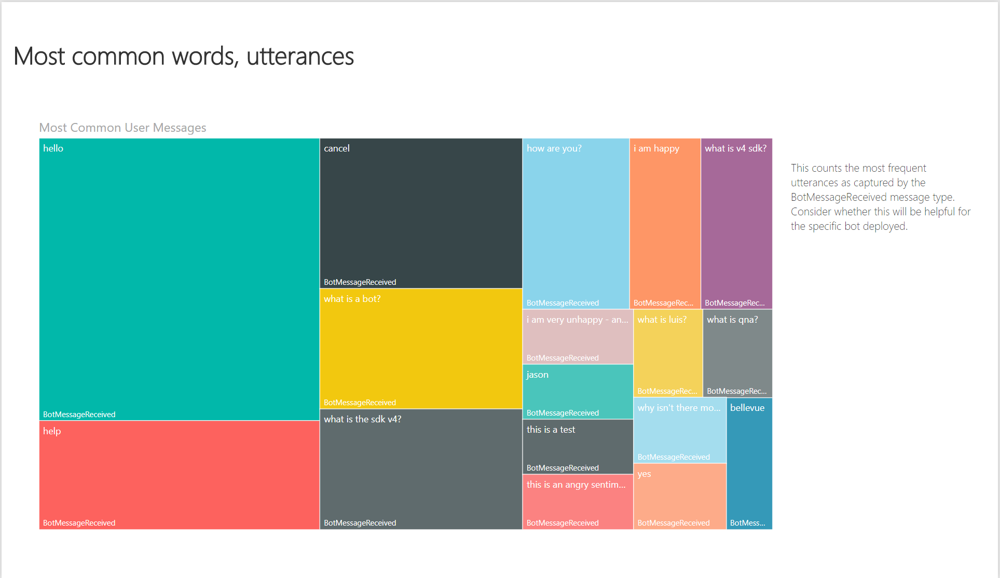

# Application Insights for Bots
[Application Insights](https://azure.microsoft.com/en-us/services/application-insights/) is a Azure service which enables analytics about your applications, infrastructure and network.

The Bot Framework can use the  Application Insights telemetry to provide information about how your bot is performing, and track key metrics. 

## Table of Contents
[Install Application Insights](##install-application-insights)
[Disabling Application Insights](###disabling-application-insights)
[Configuring LUIS Sentiment](###configuring-sentiment)
[Application Insights Queries](##application-insights-queries)
[Troubleshooting](##troubleshooting)


## Install Application Insights
Application Insights must be created before the bot is deployed, since configuration strings must be provided to the bot in the form of the [Bot Configuration] file.   

### Deployment using the MsBot command line tool
The MsBot tool blah blah

### Deployment using the Azure Portal
The Azure portal can be used to deploy your Application Insights using the Azure Portal.  You may choose this option if you already have an existing Application Insights deployment or you want to place Application Insights into a separate Azure Resource Group.

Blah, blah


### Disabling Application Insights

To turn off Application Insights logging for C#, open up the `Startup.cs` file and uncomment the following lines:

```csharp
       public void Configure(IApplicationBuilder app, IHostingEnvironment env)
        {
            // Uncomment to disable Application Insights.
            // var configuration = app.ApplicationServices.GetService<Microsoft.ApplicationInsights.Extensibility.TelemetryConfiguration>();
            // configuration.DisableTelemetry = true;
```


### Configuring Sentiment
LUIS enables sentiment to be logged.  This can be enabled through the [LUIS portal](https://www.luis.ai).
Sentiment is enabled for each application.  To enable sentiment, log in to the portal, select "My Apps" , click on the specific application you want to enable sentiment.
Select "Manage" on the upper menu, and "Publish Settings" on the side menu.  It should resemble below.

Click on "Use sentiment analysis to determine if a user's utterance is positive, negative, or neutral." checkbox.


## Application Insights Queries
The following provide some examples of retrieving data about your bot, to better understand how your bot (and related services) are performing.

###  LUIS Intents Piechart

The following query demonstrates querying data that was generated by the LUIS telemetry in the sample.  The telemetry logs the top intent from the recognizer (in addition to some other properties), and logs an [Application Insights Custom Event](https://docs.microsoft.com/en-us/azure/application-insights/app-insights-api-custom-events-metrics).


```
customEvents
| where timestamp >= ago(24h)
| where name startswith "LuisIntent"
| summarize count() by name
| order by count_ desc
| render piechart
```


### P50, P95, P99 for Services

The following query demonstrates querying data from the Application Insights `dependencies` table which models calls to external components.


CosmosDB
```
dependencies
| where timestamp >= now(-1d)
| where type == "Azure DocumentDB"
| summarize percentiles(duration,50,95,99) by bin (timestamp, 1m)
| render timechart
```
Azure Blob Storage
```
dependencies
| where timestamp >= now(-1d)
| where type == "Azure blob"
| summarize percentiles(duration,50,95,99) by bin (timestamp, 1m)
| render timechart
```
LUIS

```
dependencies
| where timestamp >= now(-1d)
| where type == "HTTP" and name contains "/luis"
| summarize percentiles(duration,50,95,99) by bin (timestamp, 1m)
| render timechart
```

## Power BI
The samples provide a PowerBI report that can be used to understand how the bot is performing.  Here are some sample pages of the report.

### Overall Usage

### Conversation Flow

### Demographics

### Sentiment

### Users and Conversations

### Common Words

### Word Cloud


## Troubleshooting
### I am not seeing all event types.
In C# ASP.Net Core, ensure the `appsettings.json` file contains an `InstrumentationKey`:
```json
 {
  "botFilePath": "Mybot.bot",
  "botFileSecret": "MySecret",
  "ApplicationInsights": {
    "InstrumentationKey": "<MyAppInsights_key>"
  }
}
```
